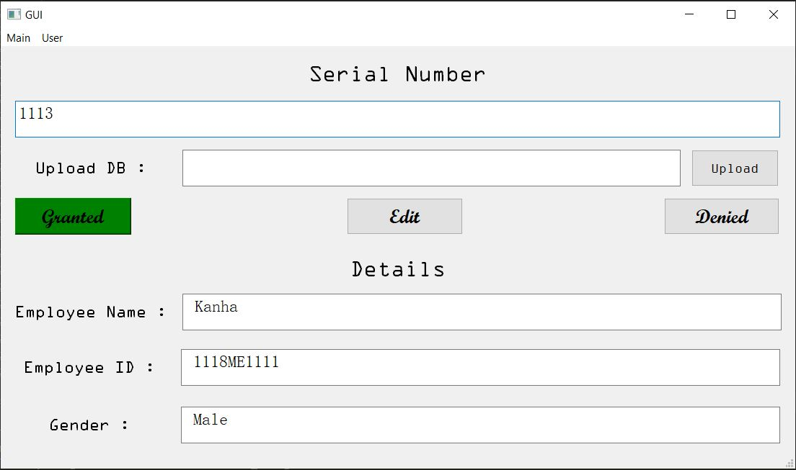
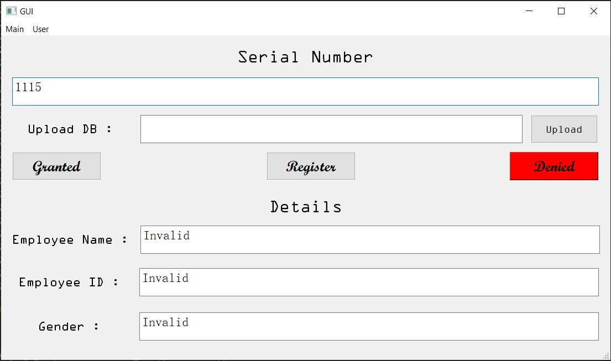

# RFID_GUI


[](#contributors-)
[](https://wa.me/7606814973)


## 📌 Prerequisites
- Windows 10
- [Python](https://www.python.org/downloads/release/python-387/) (Python 3.8.7)
- [Git](https://git-scm.com/) (Git 2.30.0)

## 💻 Clone
Open Git Bash and type the following code
```sh
$ git clone https://github.com/krishnamecho/RFID_GUI.git
```

## :rocket: Get started 

### Method-1
1 - Install python latest version from the link provided in the prerequisite in your system.

2 - Double click the runner.bat file.

3 - The bat file shall be execute the gui.py file.

### Method-2
Run the following code in either command prompt or anaconda prompt
```sh
$ pip install -r requirements.txt
$ python gui.py
```

## ⭐ Preview
If granted

If denied


### Parsing values
```sh
$ python test.py --s <integer_serial_no> --db <path_to_input_db_in_string_format>
```
